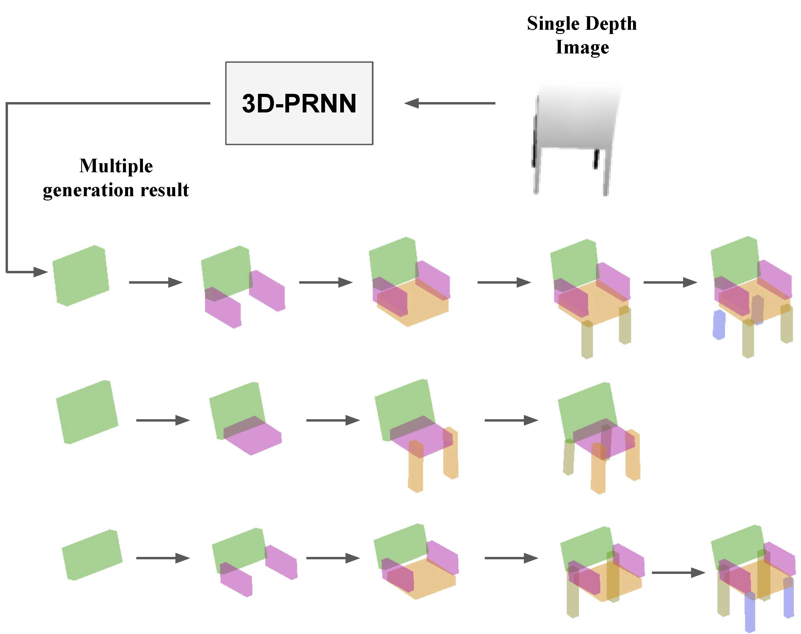

# 3D-PRNN
Torch implementation of ICCV 17 [paper](http://openaccess.thecvf.com/content_ICCV_2017/papers/Zou_3D-PRNN_Generating_Shape_ICCV_2017_paper.pdf): "3D-PRNN, Generating Shape Primitives with Recurrent Neural Networks"



## Prerequisites
- Linux
- NVIDIA GPU + CUDA CuDNN
- Torch
  
  matio: https://github.com/tbeu/matio
  
  distributions: https://github.com/deepmind/torch-distributions

- Matlab (for visualization)

## Data
- Download primitive data to current folder
```
wget http://czou4.web.engr.illinois.edu/data/data_3dp.zip
```
  
This includes our ground truth primitives (folder "prim\_gt") and the original ModelNet mesh (folder "ModelNet10\_mesh")

## Train
- For shape generation from scratch:
```
th driver.lua
```

- For shape generation conditioned on single depth map:
```
th driver_depth.lua
```

## Generation
- For shape generation from scratch:
```
th testNet_3dp.lua
```

- For shape generation conditioned on single depth map:
```
th testNet_3dp_depth.lua
```

## Visualization
- To visualize ground truth primitives, run visualizeGTPrimitive.m in Matlab
- To visualize sample shape generation, run visualizeRandomGeneration.m 
- To visualize sample shape generation conditioned on depth, run visualizeDepthReconGeneration.m

## Primitive ground truth
- See ./matlab/ folder

## Note
For shape generation conditioned on depth, as explained in the paper Sec 5.1,  we perform a nearest neighbor query based on the encoded feature of the depth map to retrieve the most similar shape in the training set and use the configuration as the initial state for the RNN. For convenience, we include our pre-computed initial configuration for each test class in folder "data/sample\_generation".

## Primitive parsing
We provide in the matlab folder the demo code (demo.m) to parse single primitive. To sequentially parse primitives in batch, see "script\_parse\_primitive.m". After each run of "script\_parse\_primitive.m", run "script\_parse\_primitive\_symmetry.m" to get the symmetry. With every three parses, try "script\_refine\_parse\_primitive.m" to refine the parsed primitives.

## Citation
```
@inproceedings{zou20173d,
  title={3d-prnn: Generating shape primitives with recurrent neural networks},
  author={Zou, Chuhang and Yumer, Ersin and Yang, Jimei and Ceylan, Duygu and Hoiem, Derek},
  booktitle={The IEEE International Conference on Computer Vision (ICCV)},
  year={2017}
}
```

## Acknowledgement
- We express gratitudes to the torch implementation of [hand writting digits generation](https://github.com/jarmstrong2/handwritingnet) as we benefit from the code.
